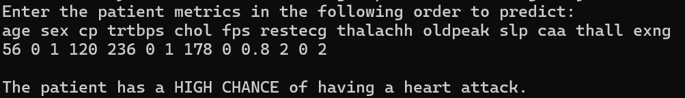

# ❤️Heart Attack Prediction

<center>
    
</center>

## Introduction
Heart attack remains one of the leading causes of mortality worldwide with US having nearly **805,000 people** suffer from a heart attack annually. The unpredictable nature of heart attacks makes them dangerous. Therefore, there is an urgent need for effective predictice tools that can foresee these events before they occur.

This repository implements machine learning techniques to train a classification model using the Heart Attack dataset from Kaggle. 

## Requirements
- Python 3.9+
- `numpy==1.26.4`
- `scikit-learn==1.3.1`
- `matplotlib==3.8.4`
- `pandas==2.2.1`


## Installation
1. Clone the repository
```
git clone https://github.com/BaKhoi/heart-attack-prediction.git

cd heart-attack-prediction

```

2. Install required packages
```
pip install -r requirements.txt

```

## Model Performance
In this scenario, **recall** is used to evaluate the model performance. Check this [notebook](HeartAttack.ipynb) for more information


The best model was the **Random Forest Classifier** with hyperparameters tuning:
- `max_depth`: 10
- `max_features`: 'log2'
- `min_samples_leaf`: 4
- `n_estimators`: 200

**Recall: 0.90625** </br>
**Accuracy: 0.86885**

## Usage
1. **Run the script**
```
python heart_attack.py
```

2. **Enter features when prompted**
   1. **High susceptibility to heart attack 💀**
   
   *Sample metrics of a patient who has a high chance of having a heart attack:*
    
    **age-sex-cp-trtbps-chol-fps-restecg-thalachh-oldpeak-slp-caa-thall-exng**
    56-0-1-120-236-0-1-178-0-0.8-2-0-2
    

    Entering the metrics without hyphens:
    ```
    56 0 1 120 236 0 1 178 0 0.8 2 0 2
    ```

    **Prediction**

    

    2. **Low susceptibility to heart attack** 🎉

    *Sample metrics of a patient who has a low chance of having a heart attack:*
    
    **age-sex-cp-trtbps-chol-fps-restecg-thalachh-oldpeak-slp-caa-thall-exng**
    45-0-0-120-180-0-1-170-0-2-0-2-0
    

    Entering the metrics without hyphens:
    ```
    45 0 0 120 180 0 1 170 0 2 0 2 0
    ```

    **Prediction**

    


